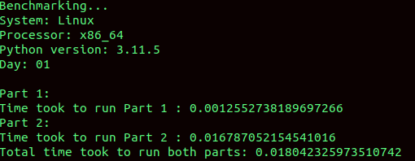
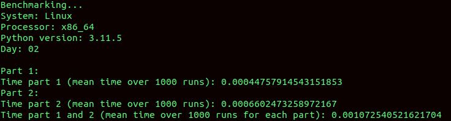
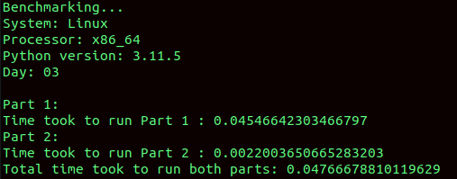
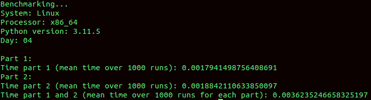
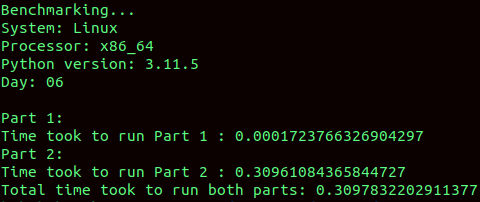
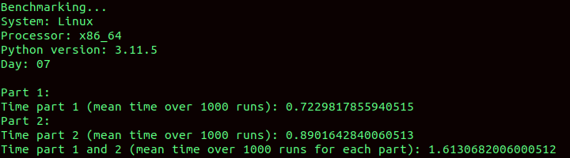
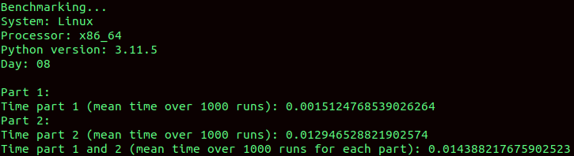
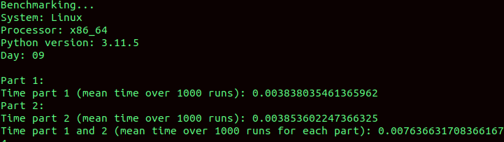
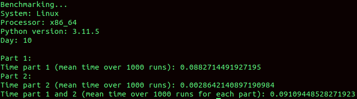

# AdventOfCode2023
[Advent of Code](https://adventofcode.com/2023/about) is an Advent calendar of small programming puzzles

Additionnal rules (Personnal challenge) :
- All solutions must be written in Python
- All parts must run in less than a seconde

## [Day 01 : Trebuchet?!](https://adventofcode.com/2023/day/1)

[problem](https://adventofcode.com/2023/day/1) / [solution](./day01/)

## [Day 02 : Cube Conundrum](https://adventofcode.com/2023/day/2)

[problem](https://adventofcode.com/2023/day/2) / [solution](./day02/)

## [Day 03 : Gear Ratios](https://adventofcode.com/2023/day/3)

[problem](https://adventofcode.com/2023/day/3) / [solution](./day03/)

## [Day 04 : Scratchcards](https://adventofcode.com/2023/day/4)

[problem](https://adventofcode.com/2023/day/4) / [solution](./day04/)

## [Day 05 : If You Give A Seed A Fertilizer](https://adventofcode.com/2023/day/5)

[problem](https://adventofcode.com/2023/day/5) / [solution](./day05/)

## [Day 06 : Wait For It](https://adventofcode.com/2023/day/6)

[problem](https://adventofcode.com/2023/day/6) / [solution](./day06/)

## [Day 07 : Camel Cards](https://adventofcode.com/2023/day/7)

[problem](https://adventofcode.com/2023/day/7) / [solution](./day07/)

## [Day 08 : Haunted Wasteland](https://adventofcode.com/2023/day/8)

[problem](https://adventofcode.com/2023/day/8) / [solution](./day08/)

## [Day 09 : Mirage Maintenance](https://adventofcode.com/2023/day/9)

[problem](https://adventofcode.com/2023/day/9) / [solution](./day09/)

## [Day 10 : Pipe Maze](https://adventofcode.com/2023/day/10)

[problem](https://adventofcode.com/2023/day/10) / [solution](./day10/)

